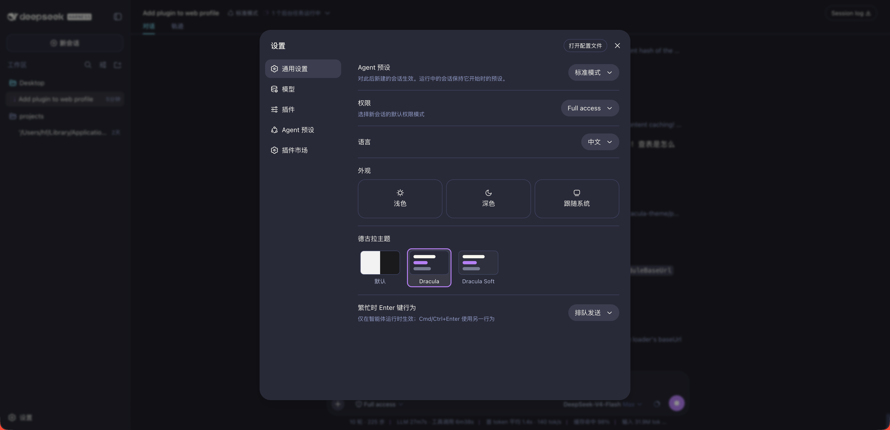

# dsh-dracula-theme

🧛 Dracula theme for [DeepSeek Harness](https://github.com/deepseek-ai/deepseek-harness) (DSH): the classic dark palette — plus the **Dracula Soft** variant — registered into the built-in theme runtime, with a one-click skin picker in **Settings → General**.

## Features

- **Two faithful variants** built from the official [Dracula palette](https://draculatheme.com):
  - `Dracula` — the classic `#282a36` canvas
  - `Dracula Soft` — the gentler `#343746` background
- Core logic adopted from the **official [Dracula DeepSeek port](https://github.com/dracula/deepseek)** (MIT): the canvas/brand `--dsw-static-*` overrides and code-highlight palette are taken verbatim and translated into the DSH theme runtime. On top of that, full token coverage: neutral & canvas ramps, brand (purple), blue (cyan), red / green / amber state colors, alias surfaces, component-specific tokens (sidebar, bubbles, composer, menus) and the official Dracula syntax colors for code highlighting (`--shiki-*`).
- One-click switching from **Settings → General → Dracula theme**, persisted across sessions.

## Preview



The classic Dracula canvas (`#282a36`) mapped onto the full DSH surface stack — sidebar, conversations, code blocks — with the purple/cyan brand accents from the official Dracula DeepSeek port.

## Palette

| Role | Color |
| --- | --- |
| Background | `#282a36` |
| Dark background (base canvas) | `#20212b` |
| Current line / selection | `#44475a` |
| Foreground | `#f8f8f2` |
| Comment | `#6272a4` |
| Purple (brand) | `#bd93f9` |
| Pink (keyword) | `#ff79c6` |
| Cyan (link) | `#8be9fd` |
| Green (success) | `#50fa7b` |
| Yellow (string) | `#f1fa8c` |
| Orange (warn) | `#ffb86c` |
| Red (error) | `#ff5555` |

## Installation

```sh
# from npm (prebuilt, recommended)
dsh plugin --profile web add dsh-dracula-theme

# or from source
dsh plugin --profile web add https://github.com/ossFrankFrank/dsh-dracula-theme
```

Restart the profile, then pick the skin in **Settings → General → Dracula theme**.

## Development

```sh
npm run generate   # rebuild themes/*.json and lib/client.js from palette/dracula.json
```

The token tables are generated: edit the anchors in `palette/dracula.json` (colors, the official `canvasRamp`/`brandRamp`/`codeTokens` mappings, `grayRamp`, `soft.background`) and regenerate. `lib/client.js` is the browser bundle consumed by the DSH client runtime; `lib/index.js` is a no-op host entry.

## License

MIT — see [LICENSE](LICENSE). Structure modeled on [dsh-catppuccin](https://github.com/zhijun-dai/Catppuccin-dsh-theme) (MIT); token mapping adopted from the official [Dracula DeepSeek port](https://github.com/dracula/deepseek) (MIT).
